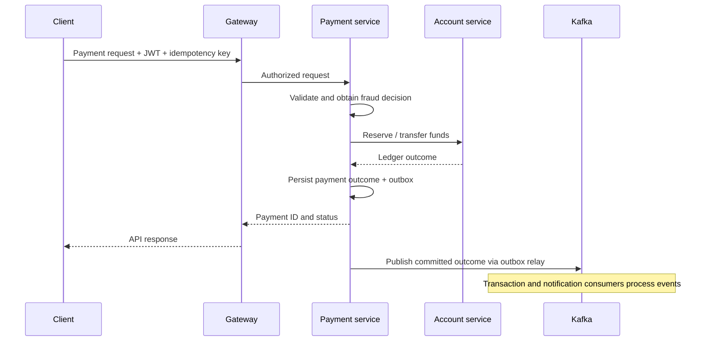

# Payment System — Microservices Architecture Demo

A Java payment-system project for interview architecture walkthroughs and freelance implementation planning.

> **Current status: scaffold, not a runnable payment demo.** The repository contains Maven module definitions and example YAML routing configuration. It does not yet implement authentication, payment APIs, account transfers, or Kafka messaging. Do not present the proposed flow below as completed functionality.

## Verified baseline

Reviewed against commit `d5e493d32d42d68f02915179574286dc880a6f6a` on `master`.

| Area | Present in repository | Still required |
| --- | --- | --- |
| Java / Spring Boot | Root POM declares `java.version=17` and `spring.boot.version=3.5.13` | Compiler configuration and Boot dependency management/plugins; the version properties alone do not activate them |
| Maven | Parent aggregator with eight modules; child POM dependency lists are empty | Application dependencies, source code, executable packaging and tests |
| Gateway / WebFlux | YAML route examples for `/payments/**` to `http://localhost:8084` | Spring Cloud Gateway/WebFlux dependencies, application entry point and working routes |
| JWT | Mentioned in the original README | Token issuance, verification, key management and authorization |
| Kafka | Mentioned in the original README | Broker configuration, topic contracts, producers and consumers |
| Docker | `docker-compose.yml` exists but is **zero bytes** | Compose services, Dockerfiles/images, network, volumes and readiness checks |
| Payment processing | Module names | Controllers, persistence, business rules, state transitions and integration tests |

There are no tracked Java files, Dockerfiles, Maven wrapper, or test suites at this baseline. YAML files sit at module roots rather than the usual `src/main/resources/application.yml`; no code/build setup loads them. All example YAML files declare port `8080`. No configured service proves that anything listens on `8084`.

## Service map

Responsibilities below are **proposed boundaries**, not implemented behavior. Module links point to the actual files.

| Directory | Maven artifact / inclusion | Intended responsibility | Verified runtime status |
| --- | --- | --- | --- |
| [api-gateway](api-gateway/pom.xml) | `api-gateway`; in reactor | External entry point, JWT verification, routing | YAML only; no running WebFlux gateway |
| [auth-service](auth-service/pom.xml) | **`auth-gateway`**; in reactor | Login and token issuance | No auth endpoints; directory/artifact naming differs |
| [user-service](user-service/application.yml) | No POM; **not in reactor** | User profile management | YAML only |
| [account-service](account-service/pom.xml) | `account-service`; in reactor | Account ownership, balances and ledger | No account API/database |
| [payment-service](payment-service/pom.xml) | `payment-service`; in reactor | Payment validation and orchestration | No payment API/state machine |
| [transaction-service](transaction-service/pom.xml) | `transaction-service`; in reactor | Transaction history/projection | No persistence or event consumer |
| [fraud-service](fraud-service/pom.xml) | **`fraud-gateway`**; in reactor | Fraud/risk decision | No risk rules; directory/artifact naming differs |
| [notification-service](notification-service/pom.xml) | `notification-service`; in reactor | Notify after payment outcome | No event consumer/delivery integration |
| [common-lib](common-lib/pom.xml) | `common-lib`; in reactor | Shared contracts/utilities | Empty library scaffold; should not become an independently deployed service |

The YAML route IDs are labels, not evidence of service discovery. The gateway's route ID is `api-gateway`; its destination is still `localhost:8084`. In a container, `localhost` refers to that container, so the future Compose setup needs service DNS names.

## Payment flow — proposed implementation

**No payment currently travels through this repository.** Use this sequence to explain the intended design and the work remaining.



1. **Authenticate:** auth-service verifies credentials and issues a token. Gateway verifies signature and claims. Neither operation exists yet.
2. **Submit:** client sends source/destination account, amount/currency and an idempotency key. Gateway routes the request without blocking its event loop.
3. **Validate:** payment-service checks the authenticated account owner, valid positive amount, supported currency and duplicate request. Persist the request identity before side effects.
4. **Assess risk:** obtain a fraud-service decision before moving money; define reject, timeout and manual-review behavior explicitly.
5. **Move funds:** account-service checks available balance and writes an atomic ledger transfer. Use precise decimal/minor-unit money representation and concurrency control. A rejected transfer must not produce a success event.
6. **Record outcome:** payment-service records the result and an outbox event in one local transaction. Cross-service consistency still requires an explicit saga/reconciliation policy; an outbox alone cannot make both databases atomic.
7. **Publish:** an outbox relay publishes the committed outcome to Kafka. Retries must not execute another debit.
8. **Consume:** transaction-service updates history and notification-service delivers a message. Consumers deduplicate by event identity; notification failure must not reverse a completed payment.
9. **Read status:** client queries the payment ID. Explain that async projections may lag and a timeout does not necessarily mean the payment failed.

### Endpoint flow and contract status

| Step | What is verified today | Contract to implement |
| --- | --- | --- |
| Login | No controller or auth route | Login request/response and JWT claims |
| Submit payment | YAML path predicate `/payments/**`; destination `http://localhost:8084` | HTTP method, exact path, body, status codes, idempotency semantics |
| Check payment | No controller | Lookup by payment ID with ownership authorization |
| Check account/history | No controller or gateway route | Authorized balance and history APIs |
| Observe async result | No Kafka topic/listener | Versioned outcome event and consumer contracts |

No concrete login URL, payment body, credentials, topic name or successful curl response can be inferred from the current files. Add executable curl examples only when controllers and integration tests establish those contracts.

## Prerequisites

For the **current inspection walkthrough**: Git, a POSIX shell, JDK 17 and Maven (no `mvnw` is committed).

For a **future executable demo**: Docker Engine/Desktop with Compose v2, built application images, a configured Kafka broker and service databases. Those services are not supplied yet. A browser, Postman or curl can then exercise the implemented API.

## Reproducible walkthrough today

### 1. Get and identify the source

```bash
git clone https://github.com/jbualuang9179/payment-system.git
cd payment-system
git rev-parse HEAD
java -version
mvn -version
```

Compare the commit to the baseline above; later code may change these findings. Java should report 17 for the intended baseline.

### 2. Inspect declared modules and routing

```bash
cat pom.xml
cat api-gateway/pom.xml
cat api-gateway/application.yml
cat auth-service/pom.xml
cat fraud-service/pom.xml
```

Expected: eight modules, empty gateway dependencies, `/payments/**` targeting `localhost:8084`, and the auth/fraud artifact names shown in the service map. The declared Java/Boot properties do not prove the frameworks are installed.

### 3. Verify implementation and Docker gaps

```bash
git ls-files '*.java' '*Dockerfile*' '*mvnw*' '*src/test/*'
wc -c docker-compose.yml
git ls-files '*application.yml' '*pom.xml'
```

At the reviewed baseline, the first command returns no paths; Compose reports `0` bytes; user-service has YAML but no POM. These are source-inspection checks, not successful runtime tests.

### 4. Check Maven project structure

```bash
mvn validate
```

This checks Maven model/reactor structure; it does **not** start Spring Boot or demonstrate payment processing. It may require network access to resolve Maven plugins. Do not interpret a successful validation as an API or integration-test pass.

### 5. Demonstrate the current Compose limitation (optional)

```bash
docker compose version
docker compose -f docker-compose.yml config
```

The empty file cannot describe a runnable application stack; expect a validation failure/no usable services rather than a functioning payment environment. The original `docker-compose up` instruction is not a working quick start at this baseline.

**Verification performed for this README:** tracked-file inspection, POM/YAML review and confirmation of the zero-byte Compose file. JDK 17 was available in the review environment; Maven and Docker were unavailable, so the Maven/Compose commands were not executed there. No endpoint or end-to-end test was run.

## Interview / freelance demo script

1. **Scope (1 minute):** state that this is an architecture scaffold. Show the verified-versus-planned table.
2. **Boundaries (2 minutes):** show the service map; explain why account ledger, payment orchestration and async projections have different responsibilities.
3. **Flow (3 minutes):** trace the proposed sequence. Discuss duplicate submissions, concurrent debits, fraud rejection, broker outages and timeouts.
4. **Evidence (2 minutes):** run the source-inspection commands. Explain precisely what they establish.
5. **Delivery plan (2 minutes):** agree API/event contracts and deliver the executable slice below before claiming a working payment demo.

Suggested portfolio description: “Java microservices payment-system scaffold with a documented implementation roadmap for JWT gateway access, ledger-backed payments and Kafka outcome processing.” Upgrade the description when the runtime behavior is implemented and verified.

## Next implementation milestones

- [ ] Configure JDK compilation, Boot dependency management and executable application plugins; choose a compatible Spring Cloud release. Align auth/fraud naming and decide whether user-service belongs in the reactor.
- [ ] Add application entry points/dependencies; move configuration to runtime resources; assign ports and actual gateway destinations.
- [ ] Implement login/JWT verification plus ownership checks in downstream services.
- [ ] Deliver one vertical slice: authenticate → create accounts → fund test account → submit transfer → query outcome. Document exact endpoints, payloads and seeded demo credentials.
- [ ] Add ledger persistence, atomic account updates, payment idempotency, fraud decision policy and failure/reconciliation states.
- [ ] Implement Kafka contracts, transactional outbox, consumer deduplication, retries and dead-letter handling.
- [ ] Supply Dockerfiles and Compose for applications, broker and databases with health checks; then document `docker compose up --build -d`, logs and teardown against the actual service names.
- [ ] Add automated integration tests and a repeatable demo: success, insufficient funds, duplicate key, expired token, consumer retry and broker outage. Confirm no duplicate debit and correct final balances.

## Production considerations — work still required

These are design recommendations, **not repository capabilities**.

| Technology / area | Production decision and verification |
| --- | --- |
| Kafka delivery | Use an outbox for DB/event consistency, durable publish acknowledgement and monitored relay lag. Define retries/backoff and dead-letter recovery; verify broker outage recovery without duplicate money movement. Do not claim end-to-end exactly-once payment semantics from Kafka alone. |
| Kafka ordering / consumers | Select an aggregate partition key and versioned schema; define ordering scope, retention and consumer-group ownership. Make side effects idempotent and commit offsets after durable processing. Test replay and schema evolution. |
| JWT security | Verify allowed algorithm, signature, issuer, audience and expiry; rotate keys and protect secrets. Define refresh/revocation policy and object-level authorization. Prevent direct-service access from bypassing security; test invalid/expired tokens and cross-user access. |
| WebFlux gateway | Keep blocking JDBC/SDK work off Netty event-loop threads; set request size, concurrency, rate limits and downstream timeouts. Retry payment writes only with enforced idempotency. Test latency and resource use under load. WebFlux in the gateway does not make all services reactive. |
| Docker operations | Use reachable service DNS, health/readiness checks, pinned reviewed images, non-root containers and resource limits. Externalize secrets/config; persist broker/database data and test restore. Startup ordering is not proof of readiness. |
| Money and consistency | Use precise money types and explicit currency rules, an auditable ledger, atomic balance enforcement and reconciliation. Define saga/compensation behavior for partial cross-service failures and uncertain responses. |
| Observability | Propagate correlation/payment/event IDs across HTTP and Kafka; measure latency, failure rates, consumer lag and outbox backlog. Keep credentials/tokens and sensitive payment data out of logs. |
| Verification / release | Run contract, security, concurrency and failure-path tests in CI; scan dependencies/images and rehearse rollback. Restrict management endpoints and use TLS/access controls for services, broker and databases. |

## Source references

- [Root Maven model](pom.xml)
- [Gateway route example](api-gateway/application.yml)
- [Payment module](payment-service/pom.xml) and [example YAML](payment-service/application.yml)
- [Compose placeholder](docker-compose.yml)

This project currently demonstrates planned architecture and module organization. A working payment processor requires the implementation and evidence listed above.
